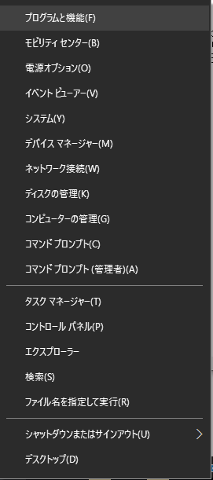
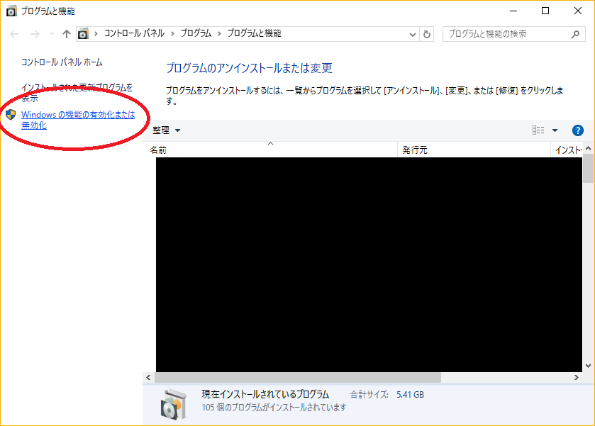
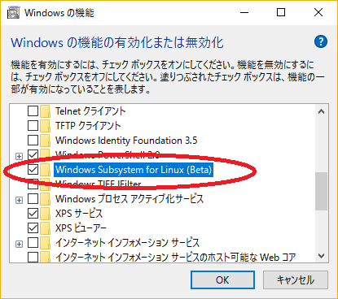
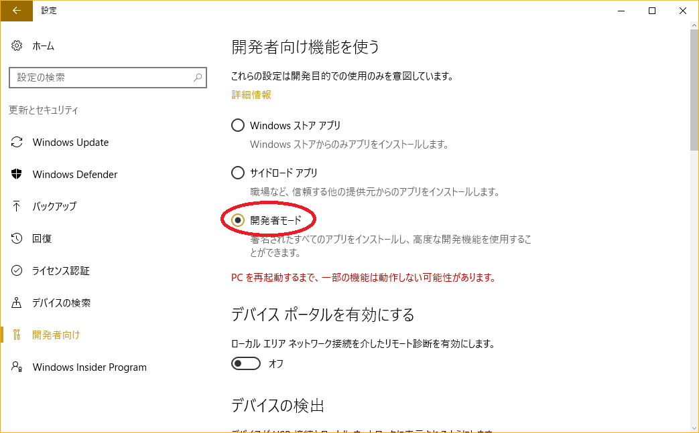
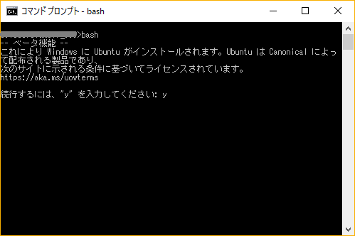
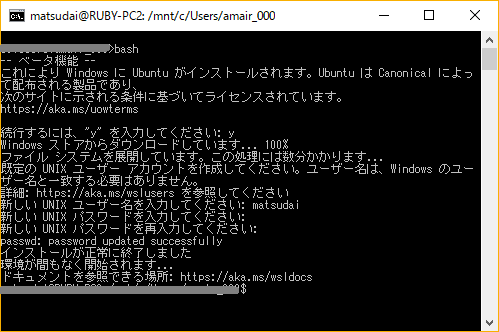

# smalrubyのインストール
* OS
  * windows10 Pro
  * バージョン：1607
  * 64ビット
* CPU
  * Intel(R) Core(TM) i3-4030U CPU @ 1.90GHz 1.90GHz
  * 64ビット
* RAM
  * 4GB

## win10へubuntu for windowsをインストールする
* [Qiitaの記事](http://qiita.com/Aruneko/items/c79810b0b015bebf30bb)を参考にインストールした
* スタートボタン右クリック→プログラムと機能→Windowsの機能の有効化または無効化
  * 
  * 
* Windows Subsystem for Linuxのチェックを入れる
  * 
* インストールされたら再起動する
* スタートメニュー→設定→更新とセキュリティ→開発者向け
* 開発者モードのチェックを入れる
  * 
* 再起動する
* コマンドプロンプトからbashを立ち上げる
  * 
* 最初はWindowsストアからのパッケージのダウンロードがあるので時間がかかります
* 初期設定（ユーザ名，パスワード，もう一度パスワード）をする
  * 

## パッケージをインストールする
* パッケージを最新のものにする
```
$ sudo apt update -y
$ sudo apt upgrade -y
```
* 必要なパッケージをインストールする
```
sudo apt install -y git autoconf bison build-essential libssl-dev libyaml-dev libreadline6-dev zlib1g-dev libncurses5-dev libffi-dev libgdbm3 libgdbm-dev libsdl1.2-dev libsdl-image1.2-dev libsdl-mixer1.2-dev timidity libsdl-ttf2.0-dev libsdl-sge-dev fonts-horai-umefont fonts-ipafont x11-apps
```
* Xmingを使いたい
  * [Qiitaの記事](http://qiita.com/makky0620/items/e31edc90f22340d791ff)を参照
  //
  //
  //

## rbenvとrubyをインストールする
* [Qiitaの記事](http://qiita.com/ringo/items/4351c6aee70ed6f346c8)を参照
* aptコマンドからは入れないように！
* rbenvをインストールする
```
$ cd ~
$ git clone https://github.com/sstephenson/rbenv.git ~/.rbenv
$ git clone https://github.com/sstephenson/ruby-build.git ~/.rbenv/plugins/ruby-build
$ echo '[[ -d ~/.rbenv  ]] && export PATH=${HOME}/.rbenv/bin:${PATH} && eval "$(rbenv init -)"' >> .bashrc
$ source .bashrc
```
* rbenvのバージョン確認
```
$ rbenv -v
```
* ruby2.3.3をインストールする（今回使うのは2.3.3なので）
```
$ rbenv install 2.3.3
$ rbenv global 2.3.3
$ ruby -v
```

## 